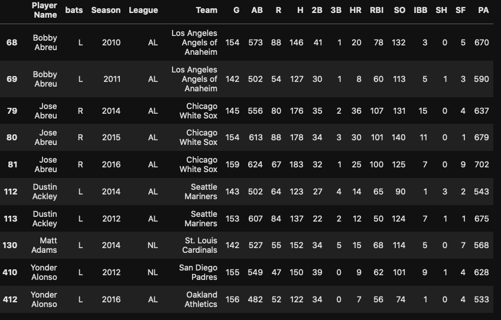
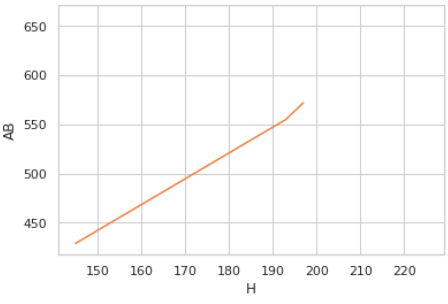
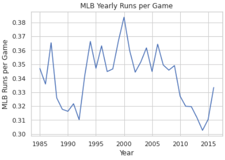
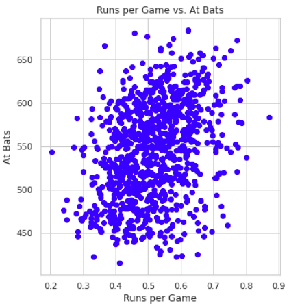

# TITLE: MLB Game Plan
## Team Members: Millon Mclendon and Jacob Caldwell
## Date: 12/10/2020

# Problem Statement and Motivation
We aim to analyze MLB data to better come up with a plan to form a winning forumla and improve a teams overall odds of winning. This motivation comes from our love for sports and simply wanting to improve our "teams" chances of winning.

# Introduction and Description of Data
This problem is important because there has been a recent shift within professional baseball to use numerical analysis of statistics to adapt there team and to optimize their playstyle in order to perform better. Teams are using these numbers to try to win more games and as a result make their teams more successful.

This problem is challenging because there are multiple statistics that are used in collaboration with others that help teams to determine a player's worth. We are attempting to use some of these statistics to help better gauge a player's worth to the team, which is a challenging and complex problem that many teams are still trying to solve


<center>Fig 1. Player Data Overview</center>

# Literature Review/Related Work 
The literature we collected during our project mainly reflected different approaches researchers used to make inferences on games, but also trying to gain knowledge of the angles used and possibly new angles to come from.

[1] Valero, C. S. (2016). Predicting Win-Loss outcomes in MLB regular season games–A comparative study using data mining methods. International Journal of Computer Science in Sport, 15(2), 91-112.

[2] Sommers, P. M. (2008). The changing hitting performance profile in major league baseball, 1966-2006. Journal of Sports Economics, 9(4), 435-440.

[3] “Scikit-Learn Tutorial: Baseball Analytics in Python Pt 1.” DataCamp Community, www.datacamp.com/community/tutorials/scikit-learn-tutorial-baseball-1. 

[4] Dhar, V. (2013). Data science and prediction. Communications of the ACM, 56(12), 64-73.

# Modeling Approach

+ The baseline model for our project involved taking in statistical data on MLB seasons 2010-2016 and cleaning it to only show stats involved with hitting.
+ After our baseline we decided to add more data to our csv and attempted to fit the model based on "salaried" players so we had updated and accurate data.

# Project Trajectory, Results, and Interpretation 

In the beginning of the project we knew that our overall goal was to come up with a way to analyze data from MLB players and come up with a "formula" of sorts to correlate different stats back to hitting leaders. This lead us to first question what stats we wanted to keep. In the process of cleaning the data we made several iterations and eventually came up with the plan to keep only stats that relate to hitting directly (ie: Hits, Plate Apperances, At Bats, etc.).

Over the course of our project, our focus shifted between different specific parts of the MLB to help us better determine and analyze more specifics of how a team fares with better batters. We initially were wanting to predict who would be the next year's best batter, but as we started to dig into the data, we became more interested in how these different batter's affected their teams and what it meant for a better player to have more at bats. This was then used to help us better determine the effects that they have and how they stack up in this method. 


<center>Fig 1. Hits over At Bats</center>


<center>Fig 2. Runs per Year Trend</center>


<center>Fig 3. Runs Versus At Bats Correllation</center>


The results that we found in the above graphs helped us to better determine coorelations within the MLB. While some of the data wasn't necessarily the most helpful, we were able to use these results to help us determine that there was indeed a coorelation between. We were able to notice that as the at bats increased, the hits also increased and the batting average (hits / at bats) tended to increase as well. We also noticed that as the amount of at bats increased, the number of runs that were scored per game also increased, showing that the players that had more at bats contributed more to their team with more runs, bettering their team's chances of winning. 

We have been able to interpret a lot from these graphs. In particular, we noticed in the second graph which notes runs per year that there were multiple different spikes that appeared to be random. However, looking into the history of the MLB, we found out that the huge spike in 2000 is likely due to the fact that steroids became legal within the USA around that time, which likely also resulted in a lot of players taking performance enhancing drugs to perform better. This would play a direct cause into obtaining more hits and runs as a result. There were also great lows, which is also likely as a result of these drugs beginning to become banned from professional competition. It has been quite fascinating to see how these results have real life coorelations. 

# Conclusions and Future Work
Summarize your results, the strengths and short-comings of your results, and speculate on how you might address these short-comings if given more time.

# References:
https://data.world/makeovermonday/2019w19/workspace/file?filename=MLB%20Stats.csv We will be using data.world for most of our csv files on MLB statistics and also adding more research papers in the future.

# Support Materials
+ juypter notebook title project.ipynb
+ All pictures contained in the folder ~/Figs
+ mlb.csv obtained from data.world

# Declaration of academic integrity and responsibility

```
With my signature, I certify on my honor that:

The submitted work is my and my teammates' original work and not copied from the work of someone else.
Each use of existing work of others in the submitted is cited with proper reference.
Signature: Millon McLendon and Jacob Caldwell Date: 12/01/2020
```

# Credit
The above project template is based on a template developed by Harvard IACS CS109 staff (see https://github.com/Harvard-IACS/2019-CS109A/tree/master/content/projects).
