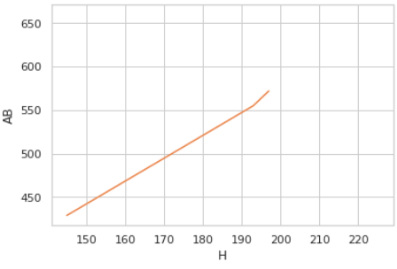
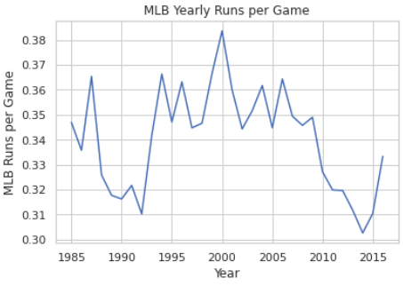

# TITLE: MLB Game Plan
## Team Members: Millon Mclendon and Jacob Caldwell
## Date: 12/10/2020

# Problem Statement and Motivation
We aim to analyze MLB data to better come up with a plan to form a winning forumla and improve a teams overall odds of winning. This motivation comes from our love for sports and simply wanting to improve our "teams" chances of winning.

# Introduction and Description of Data
This problem is important because there has been a recent shift within professional baseball to use numerical analysis of statistics to adapt there team and to optimize their playstyle in order to perform better. Teams are using these numbers to try to win more games and as a result make their teams more successful.

This problem is challenging because there are multiple statistics that are used in collaboration with others that help teams to determine a player's worth. We are attempting to use some of these statistics to help better gauge a player's worth to the team, which is a challenging and complex problem that many teams are still trying to solve

# Literature Review/Related Work 
The literature we collected during our project mainly reflected different approaches researchers used to make inferences on games, but also trying to gain knowledge of the angles used and possibly new angles to come from.

[1] Valero, C. S. (2016). Predicting Win-Loss outcomes in MLB regular season games–A comparative study using data mining methods. International Journal of Computer Science in Sport, 15(2), 91-112.

[2] Sommers, P. M. (2008). The changing hitting performance profile in major league baseball, 1966-2006. Journal of Sports Economics, 9(4), 435-440.

[3] “Scikit-Learn Tutorial: Baseball Analytics in Python Pt 1.” DataCamp Community, www.datacamp.com/community/tutorials/scikit-learn-tutorial-baseball-1. 

[4] Dhar, V. (2013). Data science and prediction. Communications of the ACM, 56(12), 64-73.

# Modeling Approach

+ The baseline model for our project involved taking in statistical data on MLB seasons 2010-2016 and cleaning it to only show stats involved with hitting.
+ After our baseline we decided to add more data to our csv and attempted to fit the model based on "salaried" players so we had updated and accurate data.

# Project Trajectory, Results, and Interpretation 

Briefly summarize any changes in your project goals or implementation plans you have made.
These changes are a natural part of any project, even those that seem the most straightforward at the beginning.
The story you tell about how you arrived at your results can powerfully illustrate your process. 

In the beginning of the project we knew that our overall goal was to come up with a way to analyze data from MLB players and come up with a "formula" of sorts to correlate different stats back to hitting leaders. This lead us to first question what stats we wanted to keep. In the process of cleaning the data we made several iterations and eventually came up with the plan to keep only stats that relate to hitting directly (ie: Hits, Plate Apperances, At Bats, etc.). 

Next, show your results. How well does your model and/or implementation perform? Did you meet your goals?


<center>Fig 1. Hits over At Bats</center>



<center>Fig 2. Runs per Year Trend</center>


Finally, give some interpretation. What do your results mean? What impact will your work have?

# Conclusions and Future Work
Summarize your results, the strengths and short-comings of your results, and speculate on how you might address these short-comings if given more time.

# References:
https://data.world/makeovermonday/2019w19/workspace/file?filename=MLB%20Stats.csv We will be using data.world for most of our csv files on MLB statistics and also adding more research papers in the future.

# Support Materials
+ juypter notebook title project.ipynb
+ All pictures contained in the folder ~/Figs
+ mlb.csv obtained from data.world

# Declaration of academic integrity and responsibility

```
With my signature, I certify on my honor that:

The submitted work is my and my teammates' original work and not copied from the work of someone else.
Each use of existing work of others in the submitted is cited with proper reference.
Signature: Millon McLendon and Jacob Caldwell Date: 12/01/2020
```

# Credit
The above project template is based on a template developed by Harvard IACS CS109 staff (see https://github.com/Harvard-IACS/2019-CS109A/tree/master/content/projects).
